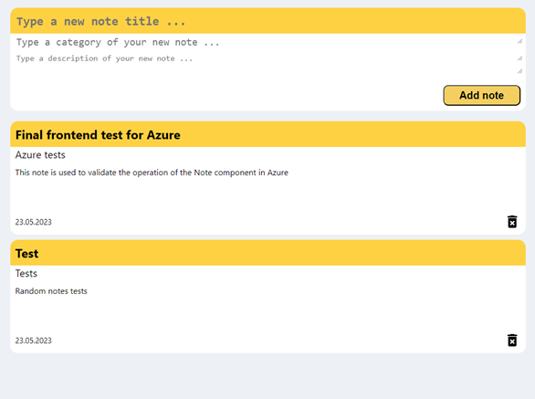
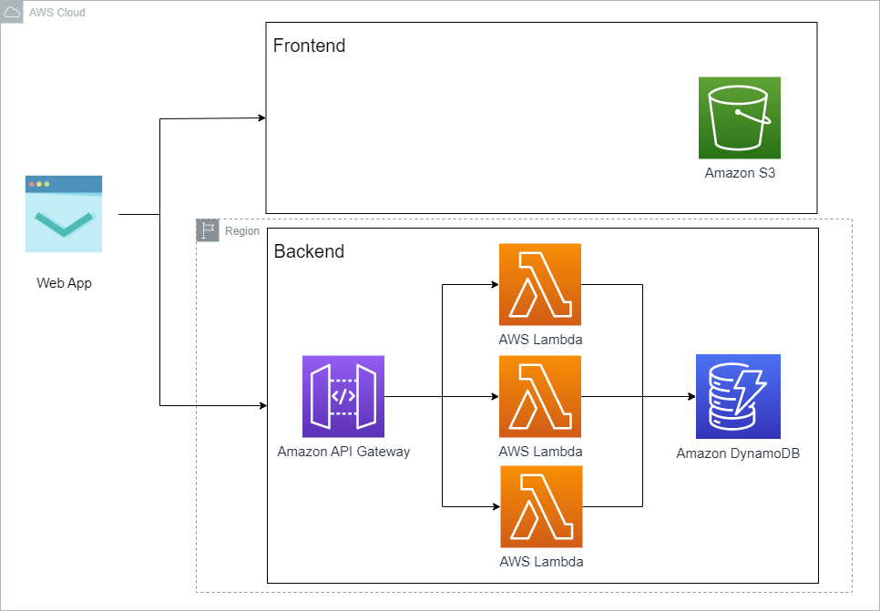
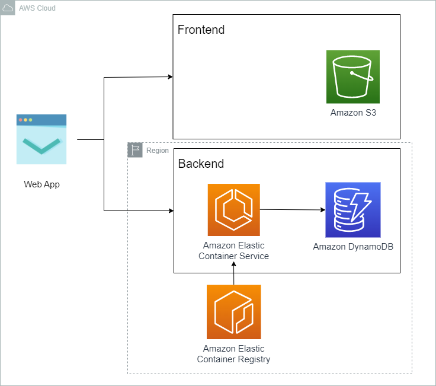
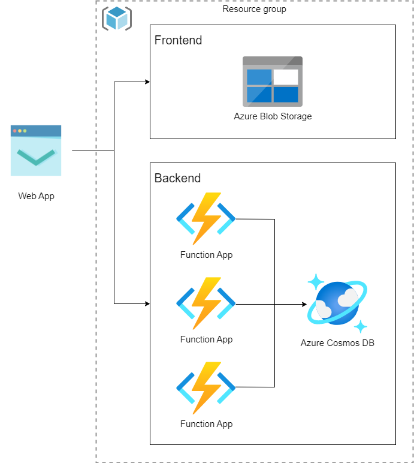
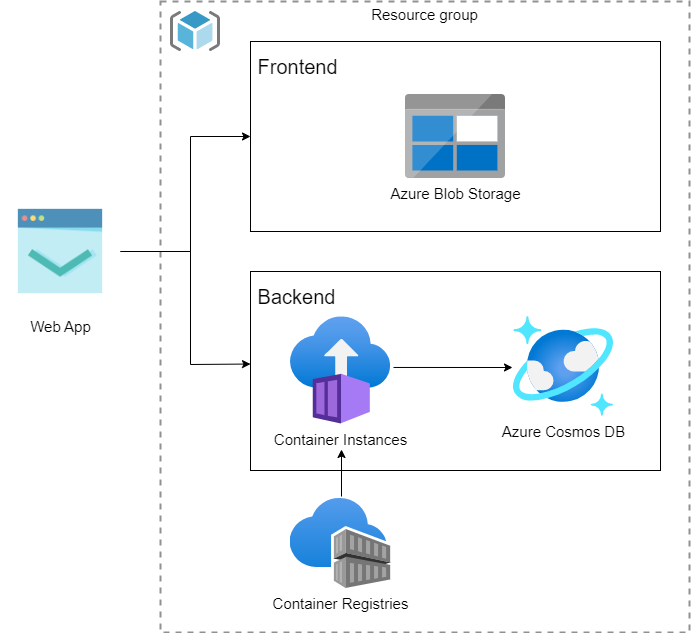

# Comparison of selected aspects of implementation and operation of web application services in AWS and Azure

## Short description
Projcet consisted in developing a web application and implementing it using various AWS and Azure cloud services in serverless technology. The use of various cloud services allowed for research in the form of functional and performance tests to compare the implementations

## Technology
Project is created with:
* AWS
* Azure
* Node.js - backend
* React - frontend
* Docker - implementation using container
* Serverless framework - AWS Lambda implementation
* k6s - performance tests
* Python - test automation script
* Matplotlib - visualization of test results

## Web application
The created web application is designed to manage notes in the database. You can add, delete and view notes. The frontend was created using React and the backend using Node.js.

## Implementation
As part of the project, 4 implementations were made, two for each cloud. The frontend was implemented using a NoSQL database (Amazon S3, Azure Blob Storage). The backend was implemented using FaaS service (AWS Lambda, Azure Functions) and containers (AWS Fargate, Azure Container Instances).

## Performance tests
Performance tests were performed using the k6s tool. As part of the tests, the following were performed:
* performance tests
* load tests
* stress tests
* breakepoint tests
* spike tests